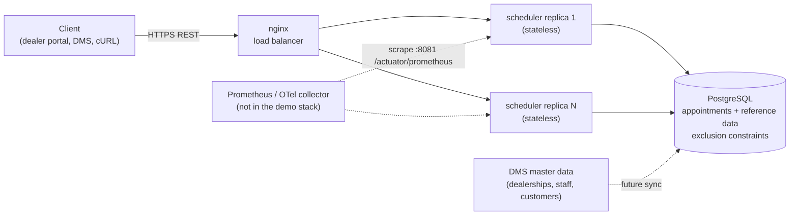
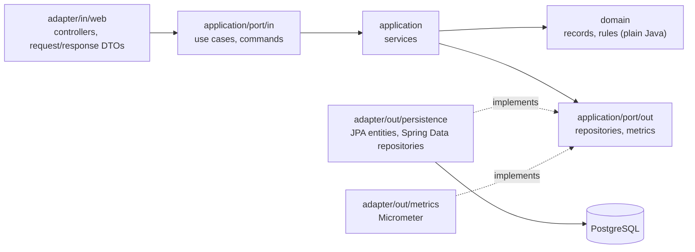
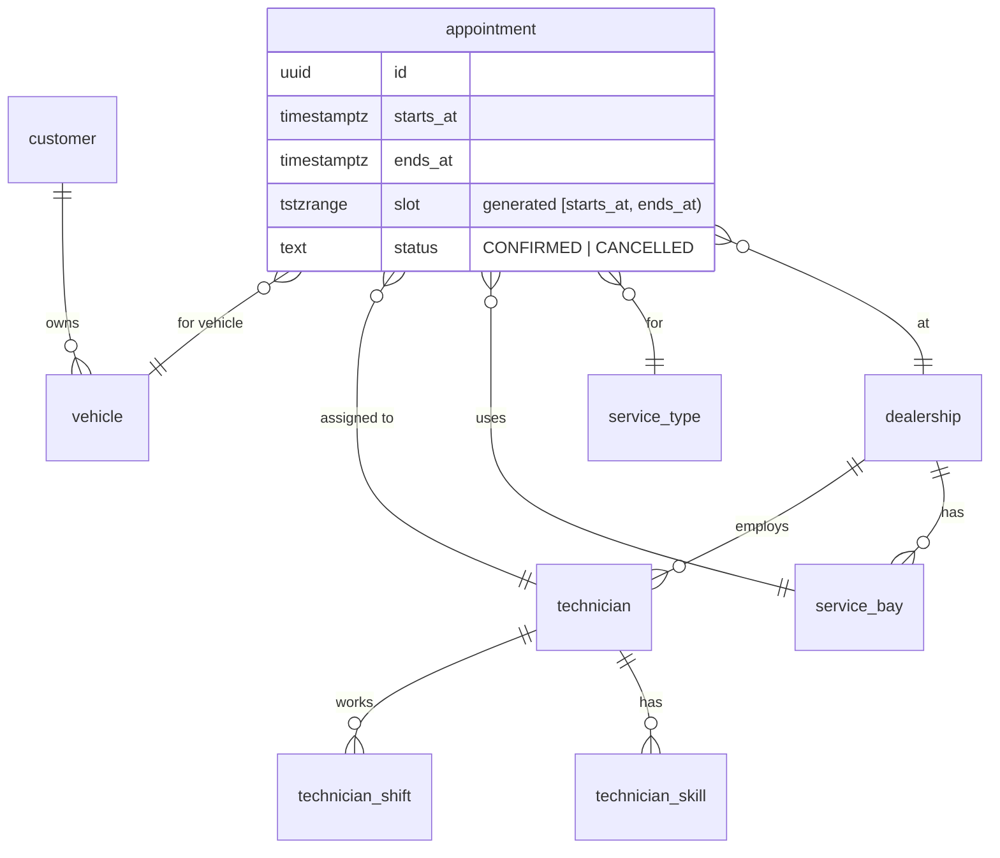
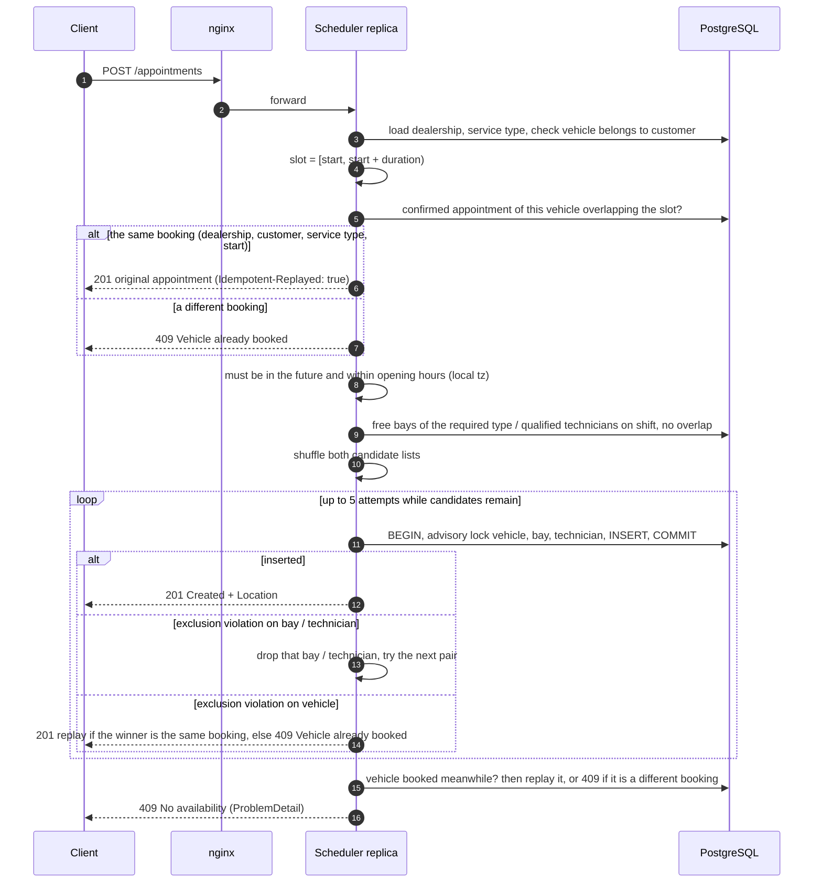

# Unified Service Scheduler: System Design

Keyloop technical assessment, Scenario A. The layer implemented is the **backend** (REST API and PostgreSQL). The client layer is stubbed with the OpenAPI contract and cURL examples.

## 1. Problem and scope

A dealership customer asks for a service appointment for a vehicle, a service type and a desired start time. The system confirms it only if **one service bay and one qualified technician are both free for the whole service duration**. The confirmed appointment links the customer, vehicle, technician and bay.

The hard part is not the CRUD. It is making sure that two requests arriving at the same moment, possibly on different app nodes, can never both get the same bay or technician. A read-then-write check (`SELECT` for availability, then `INSERT`) passes for both requests and double-books.

| Brief requirement | Where it is met |
|---|---|
| Resource-constrained booking | `POST /api/v1/appointments`: vehicle, service type, dealership and start time. The end time comes from the service type's duration. |
| Real-time availability check for bay and qualified technician over the whole duration | Candidate query, then an atomic insert guarded by Postgres exclusion constraints (section 5) |
| Persistent appointment record | `appointment` table in PostgreSQL |

In scope beyond the core, as agreed: an availability search, cancellation, and technician shifts.
Out of scope: authentication (see assumptions), rescheduling, admin CRUD for reference data, and a frontend.

## 2. Architecture



| Component | Role |
|---|---|
| **nginx** | Spreads requests over the replicas and skips a replica that refuses connections, taking it out for 5 s after 3 failures, so one slow response does not eject a healthy replica. It does **not** replay a `POST` that already reached a replica; the client sends the same request again instead, which is safe (section 5). It also rate-limits `/api/` to 100 requests per second per client IP (section 10). Actuator is not routed through it. |
| **Scheduler service** (Spring Boot, N replicas) | Stateless. Validates requests, picks candidate resources, inserts appointments, and serves availability, reads and cancel. No in-memory state affects any outcome. |
| **PostgreSQL** | The single source of truth, and the place where correctness is enforced: exclusion constraints on bay, technician and vehicle, and composite foreign keys. |
| **Schema at startup** | Hibernate creates tables and columns from the entities (`ddl-auto: update`). Then `db/constraints.sql` adds what JPA cannot express: `btree_gist`, the generated `tstzrange` columns, exclusion constraints, composite foreign keys, checks and GiST indexes. The script is idempotent and runs in one transaction under an advisory lock, so replicas can run it concurrently. Demo reference data (`db/seed/demo.sql`) is loaded the same way and is replaceable via `SEED_LOCATIONS`. |

### Inside the service: hexagonal, one package per bounded context

The service has three bounded contexts, `booking`, `availability` and `catalog` (read-only reference data), plus `shared`. Each context has the same layers:



| Layer | Holds | May depend on |
|---|---|---|
| `domain` | `Appointment`, `Dealership`, `ServiceType`, `TimeSlot`, `AvailabilityCalculator`, domain exceptions. Immutable records, no annotations. | Java and other `domain` packages only |
| `application` | Use-case ports (`BookAppointmentUseCase`, …), services, outbound ports (`AppointmentRepository`, `CandidateFinder`, `CatalogRepository`, `ResourceCalendars`, `BookingMetrics`) | Domain and ports. No JPA, Spring Data, Spring Web, HTTP types, Postgres driver or Micrometer |
| `adapter/in/web` | Controllers, DTOs; maps domain exceptions to RFC 9457 problems | Application ports and domain; never an outbound adapter |
| `adapter/out/*` | JPA entities with `from`/`toDomain` mapping, Spring Data repositories, the advisory-lock insert, constraint-name translation, Micrometer counters | Everything it implements |

- **Every database access goes through a Spring Data JPA repository**, including the native range queries and the advisory-lock insert (a repository fragment using the `EntityManager`). There is no `JdbcTemplate` or `JdbcClient` in the application code.
- **Contexts meet only through `domain` and ports.** `booking` and `availability` use `catalog`'s `CatalogRepository` port and its `Dealership` and `ServiceType` records, never its adapter.
- **Two deliberate exceptions.** The availability read model (`availability/adapter/out/persistence`) reads the appointment, bay and shift tables through the other contexts' JPA repositories. Duplicating those queries would add code for no isolation gain, since it is one database. The root package is the composition root (`SchedulerApplication`, `DatabaseWarmUp`).
- **Enforced, not described.** `ArchitectureTest` (ArchUnit) fails the build when a rule is broken. Each rule was checked by planting a violation and watching it fail.
- **Cost.** Separate domain records and JPA entities mean one mapping per aggregate, and more classes than a layered Spring app. The pay-off is that booking's retry and replay logic is unit-tested against ports alone, with no Spring, Postgres or HTTP types.

## 3. Data model



- **service_type** holds `duration_minutes`, `required_skill` and `required_bay_type`. "Qualified" means the technician has that skill; a suitable bay has that bay type.
- **technician_shift** stores `starts_at` / `ends_at` per shift plus a generated `tstzrange` column, with an exclusion constraint so a technician's shifts cannot overlap. That constraint's GiST index also serves the `shift @> slot` lookups.
- **Ranges.** Entities map plain `starts_at` / `ends_at` instants. The `slot` and `shift` range columns are `GENERATED ALWAYS AS (tstzrange(starts_at, ends_at, '[)')) STORED`, added by `db/constraints.sql`; the exclusion constraints and range queries use them, so no custom JPA type is needed.
- **dealership** has an IANA time zone and local opening hours. Everything is stored in UTC and resolved in the dealership's zone, so daylight saving is handled correctly.
- **Composite foreign keys** make the database reject an appointment whose bay or technician belongs to another dealership, or whose vehicle belongs to another customer.
- **One appointment per vehicle at a time.** A third exclusion constraint on `(vehicle_id, slot)` stops a vehicle from being in two bays at once. It also gives every booking a natural identity (vehicle and slot), which is what makes retries safe without a client-side key (section 5).

## 4. Data flow

### Booking



### Availability, list and cancel

- **Availability** (`GET /dealerships/{id}/availability?serviceTypeId&date`) loads one local day with a bounded number of queries: the bays with their busy slots, the qualified technicians with their shifts, and those technicians' busy slots. A pure function then steps through the opening hours in 15-minute increments. The result is **advisory**: booking checks everything again atomically.
- **Cancel** is one conditional `UPDATE … SET status = 'CANCELLED' WHERE id = :id AND status = 'CONFIRMED' AND starts_at > :now`; if no row changed, the appointment is read back to tell "already cancelled" from "already started". A cancelled row falls outside the constraints' `WHERE status = 'CONFIRMED'`, which frees the bay, technician and vehicle immediately. Cancelling twice returns the same result; cancelling an appointment that has already started returns `409`.

## 5. Concurrency and correctness (the core)

**1. Exclusion constraints are the guarantee.**

```sql
EXCLUDE USING gist (service_bay_id WITH =, slot WITH &&) WHERE (status = 'CONFIRMED')
EXCLUDE USING gist (technician_id  WITH =, slot WITH &&) WHERE (status = 'CONFIRMED')
EXCLUDE USING gist (vehicle_id     WITH =, slot WITH &&) WHERE (status = 'CONFIRMED')
```

Postgres rejects any confirmed row that overlaps another on the same bay, technician or vehicle, whichever node inserts it. The ranges are half-open `[start, end)`, so back-to-back jobs (10:00–11:00, then 11:00–12:00) do not conflict. The application never makes the final decision itself.

**2. Advisory locks order the writers so they cannot deadlock.**

The first concurrency test showed that two simultaneous inserts which overlap on a resource each write their tuple, then wait for the other's uncommitted tuple inside the exclusion check. Postgres resolves this as a **deadlock**, but only after `deadlock_timeout` (1 s). One client got a 500, and the waiting connections drained the pool into 503s.

The fix: each insert runs in a short transaction that first takes `pg_advisory_xact_lock` for `vehicle:<id>`, then `bay:<id>`, then `technician:<id>`, always in that order.
- A writer that conflicts on a resource waits a few milliseconds for the other to commit, and then gets a clean exclusion violation.
- Because every writer takes the locks in the same order, no wait cycle is possible.
- The locks are per resource, so there is no hot row: bookings for different vehicles, bays and technicians never wait for each other.
- The locks live in Postgres, so they coordinate every replica.
- `lock_timeout = 500ms` bounds the wait; beyond it the request fails with `503 Retry-After`. The value is sized so that the worst case, 5 attempts × 3 locks, stays well under nginx's 10 s read timeout.

The 50-way race test went from about 14 s with errors to about 0.3 s and exactly one winner.

The vehicle lock was added with the vehicle constraint, because two different bookings of one vehicle can use disjoint bays and technicians and then share no lock at all. A probe of 30 rounds × 50 such requests produced two `503`s (lock timeouts inside the exclusion check) without it, and none with it.

**3. Candidate selection is only an optimisation.** Candidates come from a snapshot query, so they can be stale. They are shuffled, so that concurrent requests for the same slot spread across the free resources instead of all colliding on the first one. When an insert hits a constraint violation, the violated constraint's name says which resource was lost; that resource is dropped and the next one is tried. The number of attempts is bounded (5), and then the service answers `409` rather than spinning. The persistence adapter reads the constraint name from the driver's `PSQLException` and hands the application an `InsertResult` (`BAY_TAKEN`, `TECHNICIAN_TAKEN`, `VEHICLE_TAKEN`), so only the adapter knows about Postgres; this is why the driver is a compile-scope dependency.

**4. Retries are safe, and the backend alone decides what a retry is.** A vehicle holds at most one confirmed appointment at a time, so the vehicle and slot identify a booking. No client-side key is needed.
- Before allocating, the service looks for a confirmed appointment of the vehicle that overlaps the slot. If it is the same booking (same dealership, customer, service type and start), the request is a repeat and gets the original appointment back, with `Idempotent-Replayed: true`.
- A different booking that overlaps the vehicle's appointment gets `409 Vehicle already booked`.
- Two in-flight copies of one request: one wins. Postgres may report the loser's error as a bay or technician overlap rather than the vehicle one, so before answering `409` the service looks for the vehicle's appointment once more and replays the winner. Without that check, a client retrying during a slow first attempt could be told "no availability" for a booking it actually holds. A test caught exactly this.
- A cancelled appointment no longer holds the vehicle, so the same request made after a cancellation books afresh.

### Alternatives considered

| Option | Why not |
|---|---|
| `SELECT` then `INSERT` in a transaction (READ COMMITTED) | Races: both requests see the slot as free. |
| `SERIALIZABLE` isolation | Correct, but a serialization failure says nothing about which resource conflicted, and retry storms under contention are opaque. The constraint gives a precise, cheaper signal. |
| `SELECT … FOR UPDATE` on bay and technician rows | Serialises every booking of a bay, even non-overlapping ones, and still needs the constraint as a safety net. |
| Lock per dealership | A hot row: it serialises unrelated bookings. |
| Redis lock or Lua script | A second store to operate, and a lock that expires under GC pauses is not a correctness mechanism. |
| Client-generated `Idempotency-Key` header | The previous design. It works, but every client must generate a key per booking and keep it across retries, and a client that retries with a fresh key still double-books. The vehicle already identifies the booking, and the vehicle constraint also closes that double-booking. |
| License plate as the booking key | A plate alone would allow one booking per vehicle, ever; plates change on re-registration and are missing on new cars. The vehicle id plus the slot is stable and already in the request. |
| Flyway versioned migrations | The previous choice. Replaced by `ddl-auto: update` plus an idempotent constraint script (section 8), at the cost of migration history. |
| Kafka partitioned by resource | Worth it for flash-sale ranking where arrival order matters. Appointment booking is low volume and first-committed-wins is the right rule, so it adds an async API and infrastructure for no gain. |

### Implementation notes

- **Timestamps.** Postgres stores microseconds, so `createdAt` and the requested `startTime` are truncated to microseconds; otherwise the `POST` response and a later `GET` would differ, and a repeated request with a sub-microsecond start would not match its own booking. The Postgres JDBC driver maps `OffsetDateTime` but not `Instant`, so instants are bound as UTC `OffsetDateTime` (`UtcTimestamps`).
- **What becomes 503.** `DataAccessResourceFailureException` covers pool timeouts and Postgres `53xxx` errors such as `too_many_connections`; `QueryTimeoutException`, `TransientDataAccessResourceException` and `PessimisticLockingFailureException` (lock timeout, deadlock) are transient too, and so is `CannotCreateTransactionException`, which is how a pool timeout surfaces when a JPA repository opens its transaction. All of them return `503` with `Retry-After: 1`.
- **Reference data.** `db/seed/demo.sql` holds demo data only; production would point `SEED_LOCATIONS` elsewhere, since dealerships, staff and customers come from the DMS. Every seed insert is idempotent, so the script can run at every startup.
- **Repositories.** Spring Data JPA, with native queries wherever range operators are needed. Default repository transactions are off (`enableDefaultTransactions = false`), so reads run in autocommit as single statements; the insert runs in its own short transaction and cancel is `@Transactional`. `open-in-view` is off, so no request holds a connection longer than its queries.
- **Candidate technicians.** The on-shift check in `CandidateJpaRepository.freeTechnicians` is a `CROSS JOIN LATERAL (… LIMIT 1)`, not `EXISTS`. Postgres turned the `EXISTS` into a hash semi-join that read the shifts of every technician in every dealership at that time (about 350 buffers with 50 dealerships). The `LIMIT` keeps it a per-technician lookup on the `(technician_id, shift)` exclusion index, so its cost depends on one dealership's technicians only (about 85 buffers in total). Shifts cannot overlap, so a technician has at most one covering shift and the join adds no duplicates.
- **Cold start.** Hibernate's first executions are slow (about 1.3 s for the first request per replica). A startup runner executes every read query once and the dispatcher servlet initialises eagerly, both before readiness reports `UP`; the first request then takes about 0.3 s. A burst of traffic onto a replica that has just started is still slower than steady state until the JIT has warmed up, which is why the E2E failover test warms both replicas first.

## 6. Scalability and reliability

- **Stateless replicas.** Any node can serve any request, and scaling out means adding replicas. The docker-compose stack runs 2 replicas behind nginx.
- **Where the load goes.** Writes are small, single-row inserts, and contention is confined to one bay or technician at one time. Bookings for one dealership run to tens or hundreds a day, so Postgres write capacity is not the bottleneck; reads (availability searches) dominate.
- **Next steps if load grows.** Availability could move to a read replica, since it is advisory and slightly stale data is acceptable. Short-lived caching of reference data could follow. Every constraint is local to one dealership, which makes `dealership_id` a natural shard or partition key.
- **Measured, not assumed** ([load test report](loadtest-report.md)). On a laptop with 2 replicas and a 2-CPU Postgres, the stack stays inside the latency targets up to 200 req/s (90 % searches), the highest level tested; beyond that the single-CPU load generator becomes the limit. The first round of tests found the knee at 100–150 req/s, with about 95 % of database time in the technician-shift lookups. On the current schema the availability lookup is planned per technician, and the booking one was rewritten to be (section 5, candidate technicians), which lowered Postgres CPU by about a quarter. In that first round a second replica raised the knee and a bigger pool lowered it. No run produced an overlapping booking. These runs predate the vehicle-and-slot identity (section 5), which adds one indexed lookup and one advisory lock per booking and has not been re-measured.
- **Failure modes.**

| Failure | Behaviour |
|---|---|
| A replica dies mid-request | nginx sends new connections to the other replica. An in-flight `POST` returns 502, the client sends the same request again, and the result is either the committed appointment (replay) or a fresh attempt. Verified by an E2E test that SIGKILLs a replica under load: nothing is lost, duplicated or double-booked. |
| Database pool saturated | Each database call waits at most 2 s for a connection, then the request gets `503` + `Retry-After`. A search makes several calls and has no overall deadline, so under sustained overload it can still reach nginx's 10 s timeout and get `504` (measured, see the load test report). Bounding the whole request is the next step. |
| Slow query or lock | `statement_timeout = 5s` and `lock_timeout = 500ms` lead to 503. Nothing hangs until the client gives up. |
| One client floods the API | nginx lets a burst of 100 through, then answers `429` with `Retry-After: 1` above 100 requests per second for that client, before the request reaches a replica. Other clients are unaffected. |
| Replica shutdown or redeploy | Graceful shutdown drains in-flight requests (20 s). Readiness includes the DB check. |
| Two replicas start against an empty DB | `db/constraints.sql` and the seed run under an advisory lock. Hibernate's own `CREATE TABLE`s are not coordinated, so the compose stack starts `app2` after `app1` is healthy. |

## 7. API

| Method | Path | Result |
|---|---|---|
| `POST` | `/api/v1/appointments` | `201` with `Location` and `Idempotent-Replayed` (`true` for a repeated request). `400` if invalid, `404` if a referenced entity is unknown, `409` if nothing is free or the vehicle already has a different overlapping appointment, `422` for a business rule, `503` when transiently overloaded. |
| `GET` | `/api/v1/appointments/{id}` | `200` / `404` |
| `POST` | `/api/v1/appointments/{id}/cancel` | `200` (idempotent) / `404` / `409` if it has already started |
| `GET` | `/api/v1/dealerships/{id}/appointments?date=` | Appointments of that local day |
| `GET` | `/api/v1/dealerships/{id}/availability?serviceTypeId=&date=` | Free start times of that local day |

Errors are RFC 9457 `application/problem+json`. The contract is in [`openapi.yaml`](openapi.yaml), and Swagger UI is served at `/swagger-ui.html`. Any `/api/` call can also get `429` with `Retry-After` from the edge (section 10); the contract describes what the service itself returns, so it does not list it.

## 8. Technology choices

| Choice | Why |
|---|---|
| Java 21, Spring Boot 4.1 | Current LTS Java and the current Boot line (3.5 is out of OSS support). Built-in `ProblemDetail`, Actuator, Micrometer, structured logging and graceful shutdown cover the production basics without custom code. |
| PostgreSQL 17 | Range types plus `btree_gist` exclusion constraints solve "no overlap per resource" declaratively. Transactional DDL, so the constraint script applies all or nothing. |
| Spring Data JPA (Hibernate 7) | Standard repositories and entities for the CRUD-shaped parts. The range queries stay native SQL, and the violated constraint's name still comes from the driver's `PSQLException`. |
| `ddl-auto: update` + `db/constraints.sql` | Chosen over Flyway to keep schema changes in the entities. Trade-offs, accepted knowingly: no versioned history, `update` never alters or drops existing columns, it cannot add a `NOT NULL` column to a table that already has rows (an old volume crash-looped the app this way, so such a change needs a manual migration step, which is where Flyway would come back), and Hibernate recommends against it in production. Everything correctness depends on lives in the idempotent SQL script, which is covered by tests. |
| nginx | The simplest real load balancer for the demo. In production it would be the platform's LB or ingress. |
| Testcontainers | Tests run against real Postgres; H2 has no exclusion constraints or range types, so it would hide exactly the logic that matters. |
| springdoc-openapi | The contract is generated from the code, so it cannot drift. |
| ArchUnit | Turns the hexagonal dependency rules into a failing test instead of a convention. |

## 9. Observability

- **Logs:** structured JSON (ECS) in containers (`LOGGING_STRUCTURED_FORMAT_CONSOLE=ecs`). Every line carries `traceId` and `spanId`, and responses return the trace id in `X-Trace-Id` so a support ticket can quote it. Business events are logged: confirmed (with the attempt number), cancelled, and gave up under contention. No PII is logged.
- **Metrics:** Prometheus on the management port (`:8081/actuator/prometheus`):
  - `scheduler_bookings_total{outcome=confirmed|replayed|no_capacity|vehicle_busy|contention_exhausted}`
  - `scheduler_booking_conflicts_total{resource=bay|technician}`: races lost at the constraint
  - `scheduler_cancellations_total`
  - `http_server_requests_seconds` histograms (latency percentiles by route and status)
  - HikariCP pool metrics (active, pending, timeouts)
- **Tracing:** Micrometer Tracing with the OpenTelemetry bridge. Trace context is propagated (`traceparent`) and written to the logs. Exporting spans only needs an OTLP endpoint in configuration; a collector is intentionally not part of the demo stack.
- **Alerts I would set:** 5xx rate > 1 %; p99 latency of `POST /appointments` > 500 ms; `hikaricp_connections_pending` > 0 sustained; `contention_exhausted` increasing (retry budget too small or a hot slot); `no_capacity / confirmed` ratio rising (a capacity signal for the business).
- **Health:** liveness, and readiness including the DB, on the management port only; details are hidden.

## 10. Security and configuration

- **No authentication, by agreement for this exercise.** `customerId` comes from the request body. In production, identity would come from a token validated at the boundary (OAuth2 resource server), and the service would authorise that the caller may book for that dealership and customer.
- All SQL is parameterised, input is validated with Bean Validation, and error bodies never include SQL or stack traces.
- Configuration and secrets come from environment variables. The container runs as a non-root user. Actuator is not reachable through the load balancer.
- **Rate limiting at the edge.** nginx allows 100 requests per second per client IP on `/api/` (`limit_req`, burst 100, no delay) and answers `429` with `Retry-After: 1` and a problem+json body. A rate limit needs shared counters: counters inside each app replica would multiply the limit by the number of nodes. In this stack nginx is the single entry point, so its counters are shared by every replica. With more than one load-balancer node, or once there is authentication, it belongs at the API gateway, keyed by the authenticated client rather than the IP. It protects fairness between clients; overload protection is the separate job of the bounded pools and timeouts (section 6).

## 11. Assumptions

1. The system assigns the bay and technician automatically; the client does not choose them.
2. "Qualified" means the technician has the service type's required skill. Bays are typed, and a service needs one bay type.
3. A booking must start in the future, and must start and finish inside the dealership's opening hours on the local day it starts. Opening hours are the same every day; the seed has no shifts on Sundays, so nothing can be booked then.
4. One appointment has one service type. A multi-job visit would be several back-to-back appointments, since a vehicle holds one appointment at a time.
5. There is no buffer time between jobs. It would be a one-line change: extend the stored slot.
6. Reference data (dealerships, staff, shifts, customers, vehicles) is owned by the DMS and treated as read-only here. The demo seed adds shifts for a rolling 90 days from the day it is migrated.
7. Times in the API are ISO-8601 with an offset on input and UTC instants on output. Clients render them in the dealership's zone, which the availability response includes.
8. A request identical to the vehicle's current booking (same dealership, customer, service type and start) is a repeat of it. A failed attempt (409/422) reserves nothing, so sending it again later is evaluated afresh.

## 12. Testing strategy

| Level | What it proves |
|---|---|
| Unit | Slot arithmetic, opening hours across DST, the availability calculator, and the retry loop's branches (bay lost, technician lost, vehicle already booked or won concurrently, bounded attempts), driven with mocked ports because real concurrency cannot select a branch deterministically. The persistence adapter's translation of constraint names, and the entity mapping, have their own tests. |
| Architecture (ArchUnit) | Domain is plain Java; application code uses no adapter or persistence, web, HTTP, driver or metrics types; inbound adapters never reach outbound ones; contexts meet only through domain and ports. |
| Integration (Testcontainers Postgres, HTTP) | Every endpoint and error code, qualification and shift filtering, time zones, repeated requests, one appointment per vehicle at a time, cancel frees the slot and the vehicle, fail-fast 503 when the pool is exhausted, observability endpoints. |
| Concurrency (in-process) | 50 simultaneous requests for 1 bay give exactly 1 confirmed and 49 `409`. For a slot with capacity 2, exactly 2 win, on distinct bays and technicians. 20 simultaneous copies of one request give 1 appointment. 20 simultaneous different bookings of one vehicle give 1. |
| E2E against the compose stack | The same race through nginx, with both replicas serving. 345 bookings spread over time while `app1` is SIGKILLed mid-run, with client retries: every request gets a definitive answer and nothing is lost, duplicated or overlapping. A client flooding past 100 requests per second gets `429` with `Retry-After`, and succeeds again a second later. |

CI runs `verify` (with an 80 % line-coverage gate; currently about 96 %), then brings the compose stack up and runs the E2E suite. Tests are not run inside the Docker image build, because Testcontainers needs Docker; CI and local runs cover them.

`SchemaIntegrationTest` inserts rows directly with SQL to prove the database itself rejects overlapping bookings of a bay, a technician or a vehicle, and runs `db/constraints.sql` and the seed again on a populated database to prove they are idempotent.

`OpenApiContractTest` checks that the published contract documents every success and error response, and that `docs/openapi.yaml` is identical to what the code generates. After an API change, regenerate the file with `./mvnw test -Dtest=OpenApiContractTest -Dopenapi.update=true`.

## 13. How GenAI was used in the design phase

I used Claude Code (Claude Opus) as a design partner, not as an oracle.

1. **Reading the brief.** I asked it to analyse all four scenarios against my profile and the evaluation criteria. It recommended Scenario A because the core is a real concurrency problem, and it named the trap: a check-then-insert double-booking. I chose Scenario A and the backend layer.
2. **Setting the constraints.** Before any design, I gave the AI my rules: scalable by default (2+ stateless nodes, correctness enforced in the database, every write retry-safe, proven by killing a replica) and lean everywhere else.
3. **Challenging proposals.** I checked ideas against those rules. The AI suggested nginx `limit_req`, and I first rejected it as per-instance state. I revisited it later: in this stack nginx is the single entry point, so its counters are shared, and it now enforces 100 requests per second per client; with several load-balancer nodes it would move to the gateway. I also caught the AI treating "backend" as decided when I had not chosen yet, and made it ask explicitly.
4. **Letting tests settle design questions.** The advisory-lock ordering in section 5 was not in the original design. The AI's first design relied on the exclusion constraints alone. The concurrency test exposed the deadlock and the 1-second stall, and only then did we redesign the insert path. The design doc records what was measured, not what was assumed.
5. **Moving retry safety into the backend.** The first design required a client-generated `Idempotency-Key`. I wanted the backend to own it and proposed the license plate as the key. The AI pushed back with two concrete problems (a plate alone allows one booking per vehicle, ever, and plates change) and proposed the vehicle and slot instead, which also closed a gap I had not noticed: a vehicle could be booked into two bays at once. It flagged that the new constraint would reopen the deadlock unless the vehicle joined the lock order; I asked for evidence, and a probe showed lock timeouts without the vehicle lock and none with it.

The full log of prompts, decisions and corrections is in [`ai-log.md`](ai-log.md).
